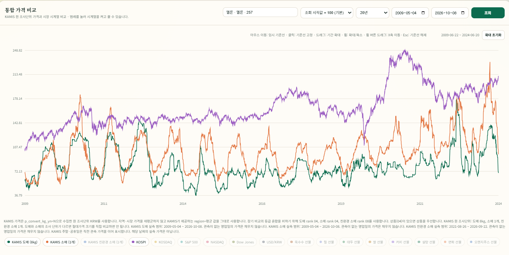
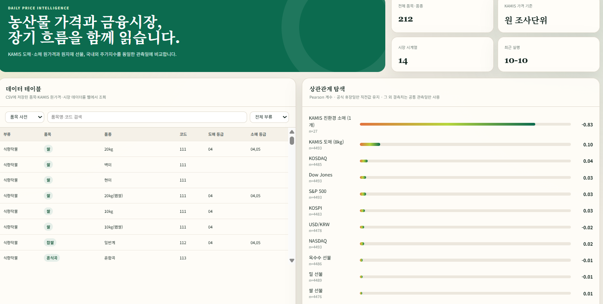

# KAMIS × 주가지수 분석

**농축수산물 가격과 주식시장은 어떻게 함께 움직일까?**

KAMIS 농축수산물 가격과 KOSPI 등 주가지수의 장기 시계열을 비교하는 분석 저장소입니다. 과거 20년 범위의 데이터를 수집하고, 대시보드에서 품목별 가격 흐름을 살펴본 뒤 변화율과 상관계수로 관계를 검토합니다. 실제 조회 가능한 기간은 품목과 시장 지표에 따라 다릅니다.



## 분석 목적

- 농축수산물 가격과 주가지수가 같은 방향 또는 반대 방향으로 움직이는지 살펴봅니다.
- 품목·품종, 도매·소매·친환경 가격, 조회 기간에 따라 관계가 달라지는지 비교합니다.
- 그래프에서 발견한 패턴을 변화율 상관계수, 관측 수, 통계적 유의성과 함께 검토합니다.

## 비교 데이터

| 데이터 | 비교 대상 | 기준 |
| --- | --- | --- |
| KAMIS | 식량작물·채소류·과일류 등 농축수산물 | 공식 평균 가격, 품종·등급 및 원 조사단위 |
| 주가지수 | KOSPI, KOSDAQ, S&P 500, NASDAQ, Dow Jones | 시장 관측값 |
| 보조 시장 지표 | 원/달러 환율, 옥수수·밀·대두 등 농산물 선물 | 시장 관측값 |

KAMIS는 도매·소매·친환경 가격을 구분합니다. 가격 수집에는 원 조사단위(`p_convert_kg_yn=N`)를 사용하며, 모든 품목을 kg당 가격으로 통일하지 않습니다. 예를 들어 멜론 도매 `8kg`와 소매 `1개`는 서로 다른 단위의 가격입니다.

## 대시보드로 탐색하기

품목과 기간을 선택하고 KAMIS 가격과 시장 지표를 겹쳐 볼 수 있습니다. 그래프 확대·이동, 범례 선택, 툴팁을 이용해 관심 구간의 값을 확인합니다.

| 표시 방식 | 읽는 방법 |
| --- | --- |
| 원가격 | 저장된 가격·지수 수준을 표시합니다. 각 계열의 단위를 함께 확인해야 합니다. |
| 조회 시작값 = 100 | 계열별 첫 유효값을 100으로 맞춰 이후 상대적 변화를 비교합니다. |
| 변화율 | 가격 수준 대신 관측값 간 변화를 비교합니다. |

기준값 100은 물가를 보정한 실질가격이 아니라, 서로 다른 규모의 시계열을 비교하기 위한 지수화입니다.


위 이미지는 멜론 가격과 KOSPI의 특정 구간을 확대한 탐색 예시입니다. 붉은 표시 구간의 모양이 비슷하더라도 전체 기간의 상관관계나 인과관계가 확인된 것은 아닙니다. 계절성과 분석 기간에 따라 결과가 달라질 수 있습니다.

## 상관관계 분석



대시보드에서 상관계수와 관측 수를 함께 확인할 수 있습니다. 표본이 적은 계열의 큰 상관계수는 장기간 관측한 결과와 구분해서 해석해야 합니다. 이미지의 수치는 촬영 당시 선택한 품목과 기간의 예시입니다.

별도 분석 스크립트는 KOSPI와 KAMIS 품종별 관계를 계산하고 CSV로 저장합니다.

- 공통 관측일 기준 일간 변화율의 Pearson·Spearman 상관계수
- 월간 변화율 상관계수와 참고용 가격 수준 상관계수
- 일간 상관계수의 p-value 및 다중 비교를 고려한 Benjamini–Hochberg FDR 보정
- 최소 관측 수 조건을 충족한 품종의 양·음의 상관관계 순위

```powershell
# 기본 분석
.\.venv\Scripts\python.exe scripts/analyze_kospi_kamis_correlations.py

# 2010년 이후 도매 가격, 최소 관측 수 1,000개, 상위 20개
.\.venv\Scripts\python.exe scripts/analyze_kospi_kamis_correlations.py --price-type wholesale --start-date 2010-01-01 --min-observations 1000 --top 20
```

기본 결과 경로는 `data/analysis/kospi_kamis_correlations.csv`입니다. `--output`으로 저장 위치를 지정할 수 있습니다. 분석에는 로컬에 저장된 KAMIS 및 시장 데이터가 필요합니다.

## 실행 방법

Windows PowerShell 기준입니다.

### 1. 환경 준비

```powershell
git clone https://github.com/EazyNick/KAMIS.git
cd KAMIS
git lfs install
git lfs pull

python -m venv .venv
.\.venv\Scripts\python.exe -m pip install -r requirements.txt
```

KAMIS 가격 CSV는 Git LFS로 관리하므로, 저장소의 기존 데이터를 이용하려면 실제 LFS 파일을 내려받아야 합니다.

### 2. KAMIS 인증 설정

`.env.example`을 `.env`로 복사하고 발급받은 인증 정보를 입력합니다. 기존 `.env`가 있다면 해당 값을 수정합니다.

```dotenv
KAMIS_CERT_KEY=발급받은_인증키
KAMIS_CERT_ID=발급받은_인증ID
```

현재 기본 실행 경로에서는 네이버·쿠팡 자동 수집을 중지하고 KAMIS와 금융시장 데이터 비교에 집중합니다. 관련 레거시 코드와 환경변수는 저장소에 남아 있습니다.

### 3. 대시보드 실행

```powershell
.\.venv\Scripts\python.exe app/main.py
```

- 대시보드: <http://127.0.0.1:8000/>
- API 문서: <http://127.0.0.1:8000/docs>
- 상태 확인: <http://127.0.0.1:8000/health>

시작 시 과거 데이터 보충 수집이 백그라운드에서 진행될 수 있습니다. 서버가 실행되었다고 모든 품목의 수집이 완료된 것은 아니며, 초기 수집에는 인증 정보와 네트워크 연결이 필요합니다.

## 데이터 해석 기준

- **단위와 등급:** 원가격을 비교할 때는 품종·등급·도소매 구분·조사단위를 확인합니다. 단위가 다른 가격의 절대 크기를 바로 비교하지 않습니다.
- **관측 기간:** 20년 조회 범위를 요청해도 품목의 조사 시작일, 계절성, API 제공 범위에 따라 실제 데이터가 적을 수 있습니다.
- **휴장일과 결측:** 화면에서는 휴장일 전일값 유지 및 결측 구간 선 연결로 흐름을 이어 보여줍니다. 선이 이어져 있어도 매일 실제 관측값이 존재한다는 뜻은 아닙니다.
- **명목가격:** 원가격에는 물가 조정이 적용되지 않습니다. 기준값 100으로 표시해도 물가 조정은 이루어지지 않습니다.
- **상관관계:** 장기 추세가 비슷한 가격 수준에서는 허위상관이 나타날 수 있습니다. 변화율, 관측 수, 기간, 계절성을 함께 검토하며 상관관계를 인과관계로 해석하지 않습니다.
- **수집 누락:** 로컬 데이터가 없거나 특정 API 요청이 무자료로 응답했다고 영구 미제공 품목으로 단정하지 않습니다. 확인한 코드·등급·기간과 근거는 아래 API 점검 기록에 남깁니다.

## 저장소 구성

```text
app/               FastAPI 서버, 대시보드, 수집·비교·분석 서비스
config/            품목 및 수집 관련 설정
scripts/           과거 데이터 수집, 점검, 상관관계 분석 스크립트
data/              원본·정규화 데이터, 수집 이력, 분석 결과
docs/              API 점검 기록과 개발 문서
  img/             README 대시보드 이미지
tests/             수집·정규화·분석·화면 관련 테스트
```

Python·FastAPI 기반으로 데이터를 수집하고, pandas·DuckDB·SciPy 등을 활용해 조회·분석합니다.

## 관련 문서

- [KAMIS API 제공 여부 및 코드 조합 점검](docs/api/kamis-availability-20261010.md)
- [KAMIS 카탈로그 검증 기록](docs/kamis-catalog-verification-20261009.md)
- [누락 데이터 복구 결과](docs/kamis-recovery-result-20261010.md)
- [개발 문서](docs/dev/README.md)
